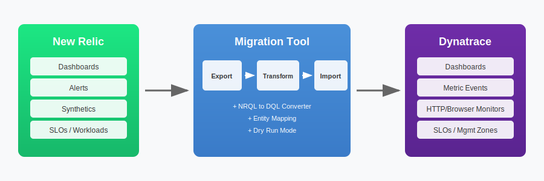
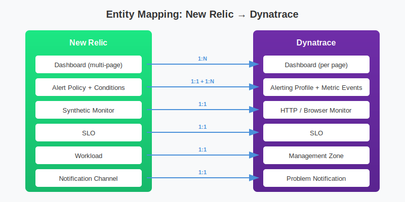

# Dynatrace-NewRelic

[](https://www.python.org/downloads/)
[](https://opensource.org/licenses/MIT)

> **⚠️ DISCLAIMER:** This project is not officially supported by Dynatrace. It is provided as-is for community use. Use at your own discretion and risk. For official Dynatrace migration support, please contact your Dynatrace account team.

Utilities for migrating from New Relic to Dynatrace.

## Tools Overview

This repository contains two complementary tools:

| Tool | Description | Location |
|------|-------------|----------|
| **NRQL to DQL Converter** | Standalone query converter | [`nrql-converter/`](nrql-converter/) |
| **Migration Framework** | Full configuration migration | [`newrelic-to-dynatrace-migration/`](newrelic-to-dynatrace-migration/) |

---

## NRQL to DQL Converter

A lightweight Python tool to convert New Relic Query Language (NRQL) queries to Dynatrace Query Language (DQL).

**Location:** [`nrql-converter/`](nrql-converter/)

### Quick Start

```bash
cd nrql-converter
./nrql_to_dql.py "SELECT count(*) FROM Transaction WHERE appName = 'MyApp' SINCE 1 hour ago"
```

### Quick Reference

| NRQL                               | DQL                                         |
| ---------------------------------- | ------------------------------------------- |
| `SELECT * FROM Log`                | `fetch logs`                                |
| `SELECT count(*) FROM Transaction` | `fetch ... \| summarize count()`            |
| `WHERE field = 'value'`            | `\| filter field == "value"`                |
| `WHERE field LIKE '%pattern%'`     | `\| filter matchesPhrase(field, "pattern")` |
| `FACET fieldName`                  | `\| summarize by: {fieldName}`              |
| `SINCE 1 hour ago`                 | `from:now()-1h`                             |
| `LIMIT 100`                        | `\| limit 100`                              |
| `average(field)`                   | `avg(field)`                                |
| `uniqueCount(field)`               | `countDistinct(field)`                      |

For detailed documentation, see [nrql-converter/README.md](nrql-converter/README.md)

---

## New Relic to Dynatrace Migration Framework

A universal, comprehensive migration framework for converting New Relic monitoring configurations to Dynatrace.

**Location:** [`newrelic-to-dynatrace-migration/`](newrelic-to-dynatrace-migration/)

### Architecture



### Supported Components

| Component         | New Relic                      | →   | Dynatrace                        | Status  |
| ----------------- | ------------------------------ | --- | -------------------------------- | ------- |
| **Dashboards**    | Dashboard (multi-page)         | →   | Dashboard                        | ✅ Full |
| **Alerts**        | Alert Policy + NRQL Conditions | →   | Alerting Profile + Metric Events | ✅ Full |
| **Synthetics**    | Ping/Browser/API Monitors      | →   | HTTP/Browser Monitors            | ✅ Full |
| **SLOs**          | Service Level Objectives       | →   | SLOs                             | ✅ Full |
| **Workloads**     | Entity Groupings               | →   | Management Zones                 | ✅ Full |
| **Notifications** | Channels (Email, Slack, etc.)  | →   | Problem Notifications            | ✅ Full |

### Pipeline


### Quick Start

```bash
# Install
cd newrelic-to-dynatrace-migration
pip install -r requirements.txt

# Configure (create .env file)
NEW_RELIC_API_KEY=NRAK-XXXXXXXXXXXXXXXXXXXXXXXXXXXX
NEW_RELIC_ACCOUNT_ID=1234567
DYNATRACE_API_TOKEN=dt0c01.XXXXXXXXXXXXXXXXXXXXXXXX
DYNATRACE_ENVIRONMENT_URL=https://abc12345.live.dynatrace.com

# Run migration
python migrate.py --dry-run --full  # Validate first
python migrate.py --full            # Execute migration
```

### CLI Reference

| Command                                            | Description                                      |
| -------------------------------------------------- | ------------------------------------------------ |
| `python migrate.py --full`                         | Complete migration (export → transform → import) |
| `python migrate.py --export-only`                  | Export from New Relic only                       |
| `python migrate.py --import-only --input ./path`   | Import to Dynatrace from previous export         |
| `python migrate.py --components dashboards,alerts` | Migrate specific components                      |
| `python migrate.py --dry-run`                      | Validate without making changes                  |
| `python migrate.py --list-components`              | List available components                        |

### Entity Mapping



| New Relic           | Dynatrace                 | Notes                                  |
| ------------------- | ------------------------- | -------------------------------------- |
| Dashboard           | Dashboard                 | Each page becomes a separate dashboard |
| Alert Policy        | Alerting Profile          | 1:1 mapping                            |
| NRQL Condition      | Metric Event              | Query conversion (limited automation)  |
| APM Condition       | Auto-Adaptive Baseline    | Manual review recommended              |
| Synthetic (Ping)    | HTTP Monitor              | Direct mapping                         |
| Synthetic (Browser) | Browser Monitor           | Script adaptation needed               |
| Synthetic (API)     | HTTP Monitor (Multi-step) | Script adaptation needed               |
| SLO                 | SLO                       | Metric expression mapping              |
| Workload            | Management Zone           | Entity selector rules                  |
| Email Channel       | Email Notification        | Direct mapping                         |
| Slack Channel       | Slack Notification        | Webhook URL update needed              |
| PagerDuty           | PagerDuty Integration     | Service key recreation                 |
| Webhook             | Webhook Notification      | Payload format adjustment              |

---

## Project Structure

```
Dynatrace-NewRelic/
├── README.md                              # This file
├── .gitignore
├── docs/
│   └── images/                            # SVG diagrams
│
├── nrql-converter/                        # Standalone NRQL→DQL converter
│   ├── README.md
│   ├── nrql_to_dql.py
│   ├── test_nrql_to_dql.py
│   └── examples.nrql
│
└── newrelic-to-dynatrace-migration/       # Full migration framework
    ├── migrate.py                         # Migration CLI entry point
    ├── requirements.txt                   # Python dependencies
    ├── .env.example                       # Environment template
    ├── CLAUDE.md                          # Development documentation
    ├── CLAUDE-for-NR.md                   # Research & reference guide
    │
    ├── config/
    │   ├── __init__.py
    │   └── settings.py                    # Configuration (pydantic)
    │
    ├── clients/
    │   ├── __init__.py
    │   ├── newrelic_client.py             # NerdGraph GraphQL client
    │   └── dynatrace_client.py            # Settings API v2 client
    │
    ├── transformers/
    │   ├── __init__.py
    │   ├── mapping_rules.py               # Entity mappings
    │   ├── dashboard_transformer.py
    │   ├── alert_transformer.py
    │   ├── synthetic_transformer.py
    │   ├── slo_transformer.py
    │   └── workload_transformer.py
    │
    └── utils/
        ├── __init__.py
        ├── logger.py                      # Structured logging
        └── validators.py                  # Config validation
```

## Required API Permissions

### New Relic API Key

| Permission            | Required For                  |
| --------------------- | ----------------------------- |
| NerdGraph access      | All exports                   |
| Dashboards (read)     | Dashboard export              |
| Alerts (read)         | Alert policy/condition export |
| Synthetics (read)     | Monitor export                |
| Service Levels (read) | SLO export                    |
| Workloads (read)      | Workload export               |

### Dynatrace API Token

| Scope                          | Required For                                 |
| ------------------------------ | -------------------------------------------- |
| `settings.read`                | Reading existing configs                     |
| `settings.write`               | Creating alerting profiles, management zones |
| `WriteConfig`                  | Creating dashboards                          |
| `ReadConfig`                   | Reading existing configs                     |
| `ExternalSyntheticIntegration` | Creating synthetic monitors                  |
| `slo.read` / `slo.write`       | SLO operations                               |

## Known Limitations

| Area                    | Limitation                    | Workaround             |
| ----------------------- | ----------------------------- | ---------------------- |
| **NRQL → DQL**          | Limited automatic conversion  | Manual query review    |
| **Scripted Synthetics** | Complex scripts not converted | Manual recreation      |
| **Entity References**   | GUIDs don't map to DT IDs     | Manual linking         |
| **Dashboard Variables** | Limited filter conversion     | Manual configuration   |
| **Dynamic Baselines**   | Not automatically converted   | Manual threshold setup |
| **Historical Data**     | Not transferable              | N/A                    |

## Related Resources

- [New Relic NerdGraph API](https://docs.newrelic.com/docs/apis/nerdgraph/)
- [Dynatrace Settings API v2](https://docs.dynatrace.com/docs/dynatrace-api/environment-api/settings)
- [Dynatrace Monaco CLI](https://docs.dynatrace.com/docs/deliver/configuration-as-code/monaco)
- [Dynatrace Terraform Provider](https://github.com/dynatrace-oss/terraform-provider-dynatrace)

## Contributing

Contributions are welcome! Please feel free to submit issues or pull requests.

## License

MIT License - See LICENSE file for details.
