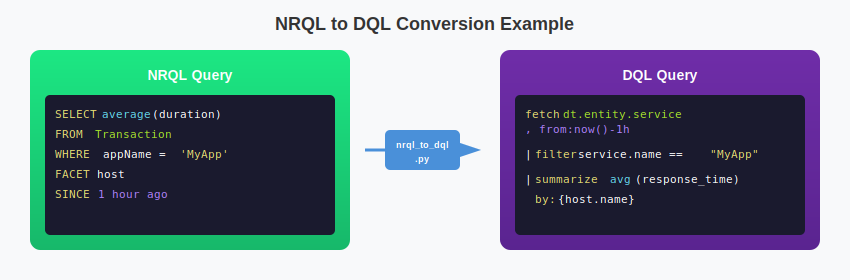

# Dynatrace-NewRelic

Utilities for migrating from NewRelic to Dynatrace.

## Tools

### NRQL to DQL Converter

A Python tool to convert NewRelic NRQL (New Relic Query Language) queries to Dynatrace DQL (Dynatrace Query Language) queries.

**Location:** `nrql-converter/`

This tool helps users migrate from NewRelic to Dynatrace by automatically converting NRQL queries to their DQL equivalents. It handles common query patterns including aggregations, filtering, grouping, and time ranges.

For detailed documentation, see [nrql-converter/README.md](nrql-converter/README.md)

#### Quick Start

```bash
cd nrql-converter
./nrql_to_dql.py "SELECT count(*) FROM Transaction WHERE appName = 'MyApp' SINCE 1 hour ago"
```

## Contributing

Contributions are welcome! Please feel free to submit issues or pull requests.

## License

This project is open source and available under the MIT License.

# New Relic to Dynatrace Migration Tool

[](https://www.python.org/downloads/)
[](https://opensource.org/licenses/MIT)

A universal, comprehensive migration framework for converting New Relic monitoring configurations to Dynatrace.

## Overview

This tool automates the migration of monitoring configurations from New Relic to Dynatrace, handling the export, transformation, and import of all major monitoring components.


## Supported Components

| Component         | New Relic                      | →   | Dynatrace                        | Status  |
| ----------------- | ------------------------------ | --- | -------------------------------- | ------- |
| **Dashboards**    | Dashboard (multi-page)         | →   | Dashboard                        | ✅ Full |
| **Alerts**        | Alert Policy + NRQL Conditions | →   | Alerting Profile + Metric Events | ✅ Full |
| **Synthetics**    | Ping/Browser/API Monitors      | →   | HTTP/Browser Monitors            | ✅ Full |
| **SLOs**          | Service Level Objectives       | →   | SLOs                             | ✅ Full |
| **Workloads**     | Entity Groupings               | →   | Management Zones                 | ✅ Full |
| **Notifications** | Channels (Email, Slack, etc.)  | →   | Problem Notifications            | ✅ Full |

## Architecture


## NRQL to DQL Converter

A standalone utility for converting New Relic Query Language (NRQL) to Dynatrace Query Language (DQL).

```bash
# Convert a single query
python nrql_to_dql.py "SELECT average(duration) FROM Transaction WHERE appName = 'MyApp'"

# Interactive mode
python nrql_to_dql.py --interactive

# Show reference table
python nrql_to_dql.py --reference
```

### Quick Reference

| NRQL                               | DQL                                         |
| ---------------------------------- | ------------------------------------------- |
| `SELECT * FROM Log`                | `fetch logs`                                |
| `SELECT count(*) FROM Transaction` | `fetch ... \| summarize count()`            |
| `WHERE field = 'value'`            | `\| filter field == "value"`                |
| `WHERE field LIKE '%pattern%'`     | `\| filter matchesPhrase(field, "pattern")` |
| `FACET fieldName`                  | `\| summarize by: {fieldName}`              |
| `SINCE 1 hour ago`                 | `from:now()-1h`                             |
| `LIMIT 100`                        | `\| limit 100`                              |
| `average(field)`                   | `avg(field)`                                |
| `uniqueCount(field)`               | `countDistinct(field)`                      |

### Example Conversion



---

## Quick Start

### 1. Installation

```bash
git clone https://github.com/timstewart-dynatrace/Dynatrace-NewRelic.git
cd Dynatrace-NewRelic/newrelic-to-dynatrace-migration
pip install -r requirements.txt
```

### 2. Configuration

Create a `.env` file or set environment variables:

```bash
# New Relic
NEW_RELIC_API_KEY=NRAK-XXXXXXXXXXXXXXXXXXXXXXXXXXXX
NEW_RELIC_ACCOUNT_ID=1234567
NEW_RELIC_REGION=US  # or EU

# Dynatrace
DYNATRACE_API_TOKEN=dt0c01.XXXXXXXXXXXXXXXXXXXXXXXX
DYNATRACE_ENVIRONMENT_URL=https://abc12345.live.dynatrace.com
```

### 3. Run Migration

```bash
# Dry run first (validates without making changes)
python migrate.py --dry-run --full

# Full migration
python migrate.py --full

# Specific components only
python migrate.py --components dashboards,alerts
```

## CLI Reference

| Command                                            | Description                                      |
| -------------------------------------------------- | ------------------------------------------------ |
| `python migrate.py --full`                         | Complete migration (export → transform → import) |
| `python migrate.py --export-only`                  | Export from New Relic only                       |
| `python migrate.py --import-only --input ./path`   | Import to Dynatrace from previous export         |
| `python migrate.py --components dashboards,alerts` | Migrate specific components                      |
| `python migrate.py --dry-run`                      | Validate without making changes                  |
| `python migrate.py --list-components`              | List available components                        |

## Entity Mapping


### Detailed Mapping Table

| New Relic           | Dynatrace                 | Notes                                  |
| ------------------- | ------------------------- | -------------------------------------- |
| Dashboard           | Dashboard                 | Each page becomes a separate dashboard |
| Alert Policy        | Alerting Profile          | 1:1 mapping                            |
| NRQL Condition      | Metric Event              | Query conversion (limited automation)  |
| APM Condition       | Auto-Adaptive Baseline    | Manual review recommended              |
| Synthetic (Ping)    | HTTP Monitor              | Direct mapping                         |
| Synthetic (Browser) | Browser Monitor           | Script adaptation needed               |
| Synthetic (API)     | HTTP Monitor (Multi-step) | Script adaptation needed               |
| SLO                 | SLO                       | Metric expression mapping              |
| Workload            | Management Zone           | Entity selector rules                  |
| Email Channel       | Email Notification        | Direct mapping                         |
| Slack Channel       | Slack Notification        | Webhook URL update needed              |
| PagerDuty           | PagerDuty Integration     | Service key recreation                 |
| Webhook             | Webhook Notification      | Payload format adjustment              |

## Project Structure

```
Dynatrace-NewRelic/
├── README.md                              # This file
├── CLAUDE.md                              # Development documentation
├── CLAUDE-for-NR.md                       # Research & reference guide
├── .gitignore
├── docs/
│   └── images/                            # SVG diagrams
│
└── newrelic-to-dynatrace-migration/
    ├── migrate.py                         # Migration CLI entry point
    ├── nrql_to_dql.py                     # NRQL → DQL converter utility
    ├── requirements.txt                   # Python dependencies
    ├── .env.example                       # Environment template
    │
    ├── config/
    │   ├── __init__.py
    │   └── settings.py                    # Configuration (pydantic)
    │
    ├── clients/
    │   ├── __init__.py
    │   ├── newrelic_client.py             # NerdGraph GraphQL client
    │   └── dynatrace_client.py            # Settings API v2 client
    │
    ├── transformers/
    │   ├── __init__.py
    │   ├── mapping_rules.py               # Entity mappings
    │   ├── dashboard_transformer.py
    │   ├── alert_transformer.py
    │   ├── synthetic_transformer.py
    │   ├── slo_transformer.py
    │   └── workload_transformer.py
    │
    └── utils/
        ├── __init__.py
        ├── logger.py                      # Structured logging
        └── validators.py                  # Config validation
```

## Required API Permissions

### New Relic API Key

| Permission            | Required For                  |
| --------------------- | ----------------------------- |
| NerdGraph access      | All exports                   |
| Dashboards (read)     | Dashboard export              |
| Alerts (read)         | Alert policy/condition export |
| Synthetics (read)     | Monitor export                |
| Service Levels (read) | SLO export                    |
| Workloads (read)      | Workload export               |

### Dynatrace API Token

| Scope                          | Required For                                 |
| ------------------------------ | -------------------------------------------- |
| `settings.read`                | Reading existing configs                     |
| `settings.write`               | Creating alerting profiles, management zones |
| `WriteConfig`                  | Creating dashboards                          |
| `ReadConfig`                   | Reading existing configs                     |
| `ExternalSyntheticIntegration` | Creating synthetic monitors                  |
| `slo.read` / `slo.write`       | SLO operations                               |

## Known Limitations

| Area                    | Limitation                    | Workaround             |
| ----------------------- | ----------------------------- | ---------------------- |
| **NRQL → DQL**          | Limited automatic conversion  | Manual query review    |
| **Scripted Synthetics** | Complex scripts not converted | Manual recreation      |
| **Entity References**   | GUIDs don't map to DT IDs     | Manual linking         |
| **Dashboard Variables** | Limited filter conversion     | Manual configuration   |
| **Dynamic Baselines**   | Not automatically converted   | Manual threshold setup |
| **Historical Data**     | Not transferable              | N/A                    |

## Output Files

After running migration:

```
output/
├── exports/
│   └── newrelic_export.json       # Raw New Relic data
├── transformed/
│   └── dynatrace_config.json      # Transformed configs
└── reports/
    └── migration_report_*.json    # Detailed results
```

## Documentation

| Document                                                   | Description                                |
| ---------------------------------------------------------- | ------------------------------------------ |
| [CLAUDE.md](./CLAUDE.md)                                   | Development guide, architecture details    |
| [CLAUDE-for-NR.md](./CLAUDE-for-NR.md)                     | Research, GitHub tools, NRQL→DQL reference |
| [Tool README](./newrelic-to-dynatrace-migration/README.md) | Detailed usage guide                       |

## Related Resources

- [New Relic NerdGraph API](https://docs.newrelic.com/docs/apis/nerdgraph/)
- [Dynatrace Settings API v2](https://docs.dynatrace.com/docs/dynatrace-api/environment-api/settings)
- [Dynatrace Monaco CLI](https://docs.dynatrace.com/docs/deliver/configuration-as-code/monaco)
- [Dynatrace Terraform Provider](https://github.com/dynatrace-oss/terraform-provider-dynatrace)

## License

MIT License - See LICENSE file for details.

---

**Note**: This tool was created to address the lack of existing New Relic → Dynatrace migration solutions. See [CLAUDE-for-NR.md](./CLAUDE-for-NR.md) for research findings.
